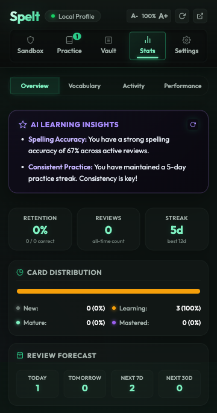

<h1 align="center">Spelt</h1>

<p align="center">
  A Chrome extension that helps you actually <em>learn</em> the words you keep misspelling.<br>
  Built around spaced repetition, not just red underlines.
</p>

<p align="center">
  
  
  
</p>

---

## What is this?

Most spell checkers tell you something is wrong and move on. Spelt does the opposite — it remembers what you got wrong and makes sure you practice it until you actually know the spelling. No more googling "accommodate" for the fifth time this week.

The idea is simple: type a word, check the spelling, and if it's wrong, Spelt saves the correction and queues it for spaced repetition review. Over time, your problem words surface less and less as you nail them. Spelt acts purely as a problem-word vault: if you check a correct spelling in the Sandbox, it is not added to your vault. If you successfully resolve a previously misspelled word during practice reviews, it is marked as Mastered and archived from your active study session.

<p align="center">
  
</p>

## 🤖 Premium AI Coaching (Gemini-Powered)

Spelt features a state-of-the-art **Gemini AI Coaching Integration** that acts as your personal vocabulary assistant. All AI interactions are designed to be **highly visual, interactive, and fully on-demand** to respect your API quotas.

### Key AI Features:
* 💡 **Interactive Spelling Mnemonics (Front & Back Face)**: Stuck on a card or want to lock down the spelling after a correct review? Click the **AI Hint** button on the front or back of the card to reveal a draggable, custom spelling trick or association.
* 📝 **Active Sentence Verification**: Practice using newly acquired words in context by writing custom sentences, then get graded instantly by the AI Coach with structured HTML corrections and suggestions.
* 📊 **Smart Learning Insights**: Generate a full analytics review from the statistics dashboard, delivering actionable tips on CEFR level distribution, study routines, and response accuracy.
* ⚡ **Quota-Efficient Fallback Engine**: Per-model feature checks (e.g. for `responseMimeType`), session-scoped error blacklisting, and zero automatic background requests protect your API quota.

<p align="center">
  
  &nbsp;&nbsp;&nbsp;&nbsp;
  
</p>

## Features

### 🔍 Spellcheck Sandbox
Type any word and press **Enter** to check it against the dictionary API.
* **Metadata Rich Feedback**: Verified words and misspelling suggestions display detailed dictionary information including **Part of Speech**, **Example Sentences** (with inflections auto-censored on practice prompts), and **Auto-Translation** (if target language is configured).
* **Fuzzy Matches**: Automatically identifies misspelled inputs and retrieves correct suggestion candidates.
* **Keyboard Hotkeys**: Press Enter to verify / accept suggestions, Space to play audio, and Escape to reject or close.

<p align="center">
  
  &nbsp;&nbsp;&nbsp;&nbsp;
  
</p>

### 🗂️ SRS Practice Deck
Spelling errors show up as spaced repetition flashcards using the SuperMemo-2 (SM-2) algorithm.
* **Contextual Clues**: Front of card displays definitions, inflected part of speech, and the word censored inside a contextual example sentence.
* **AI Spelling Hints (Front & Back)**: Access memorable, structured spelling mnemonics on both the front face (before checking spelling) or on the back face of the card (after checking spelling) to assist spelling retention.
* **Dynamic SRS Interval Hints**: Rating buttons dynamically calculate and display future intervals based on card metrics.
* **Shortcut Helper Badges**: Keyboard overlay indicators (Again `1` to Mastered `5`) guide fast reviews.
* **Interactive Mastered State**: Dedicated "Mastered" rating button (with confirmation modal) archives cards directly.

<p align="center">
  
  &nbsp;&nbsp;&nbsp;&nbsp;
  
</p>

### 🔑 Word Vault & Advanced Operations
A highly premium searchable interface to inspect and manage your vocabulary.
* **Advanced Status Filters**: Quickly filter words by *All Words*, *Active*, *Mastered*, or *Due Now*.
* **Precision Sorting**: Order cards alphabetically, by date added, or by next review date (ascending/descending).
* **Relative Countdown Badges**: Display exact scheduling durations (e.g. "Due now", "in 12d", "in 1mo").
* **Bulk Re-study & Delete**: Select multiple items (or check Select All) to delete or demaster cards in a single bulk sweep.

<p align="center">
  
</p>

### 📊 Spaced Repetition Statistics Dashboard
Track your spelling metrics and study consistency with Anki-inspired analytics.
* **Core Metrics Summary**: Real-time correct review retention rates, total practice counts, and active consecutive streak logs (including a tracked all-time record).
* **Card Distribution Progress Bar**: Segmented progress bar detailing your cards divided by *New*, *Learning*, *Mature*, and *Mastered* states.
* **7-Day Review History**: Stacked vertical bar chart comparing successful reviews against spelling errors daily.
* **Button Choice Frequencies**: Clear horizontal progress gauges illustrating how frequently you press Again, Hard, Good, or Easy ratings.
* **Leech List**: Highlights your top 10 most frequently misspelled vocabulary targets, including their failure counts and a list of your common typos.

<p align="center">
  
</p>

### 💎 Elite Premium Aesthetics
* **Glassmorphism Theme**: Translucent cards (`backdrop-filter: blur(12px)`) styled with radial glow backdrops and double-bordering.
* **Micro-Animations**: Custom spring easing curves (`cubic-bezier(0.175, 0.885, 0.32, 1.275)`) drive smooth icon bounces, active tab slider bars, inputs focused glows, and list items sliding rightwards on hover.
* **Security Wipes**: Wiping the database requires manually entering a random 6-character uppercase captcha with copy/paste fully restricted.

### 🔊 Pronunciation & Speech Synthesis Fallback
Hear how words are pronounced using local dialect audio (US/UK) fetched directly from the dictionary API. If the API doesn't provide audio files for a word, Spelt automatically falls back to the browser's native `SpeechSynthesis` API with high-quality English voices, making sure pronunciation buttons are always visible and interactive.

### 🔥 Daily Streaks
Keep your spelling practice consistent. Track your daily learning sessions with a visual combo streak indicator.

### 💾 Export / Import
Back up your database as a clean JSON file and restore it on any device.

### 🤖 Quota-Efficient Smart AI Integration
Spelt includes advanced Gemini AI coaching integration designed with efficiency and resource limits in mind.
* **Purely On-Demand Execution**: No automatic background API calls occur. AI insights, mnemonics, list enrichment, and grading run strictly when you initiate them.
* **Intelligent Feature Detection**: Fallback logic dynamically discovers whether models support specific features (like structured JSON `responseMimeType`), caching compatibility per-model to prevent failure storms.
* **Permanent Blacklisting**: Models returning non-recoverable errors (e.g. invalid arguments or deprecated endpoints) are blacklisted for the session, preserving your API quota by preventing loops.
* **Authentic Cooldown Mapping**: Only genuine rate-limit errors (429 status codes) apply temporary cooldowns.

---

## Keyboard Shortcuts

Spelt is designed to be fully navigable from the keyboard so you can study without moving your hands to the mouse.

### Global Chrome Command
* **Ctrl+Shift+S** (Mac: **Command+Shift+S**) opens the Spelt popup instantly from any webpage.
* *To customize this shortcut, paste `chrome://extensions/shortcuts` into your Chrome address bar.*

### Spellcheck Sandbox
| Hotkey | Context / State | Action |
|---|---|---|
| **Enter** | Focused in input field (with text) | Verify word spelling |
| **Enter** | Misspelling card visible | Accept top suggestion |
| **Enter** | Correct feedback card visible | Clear input and refocus for the next word |
| **Space** | Any feedback card visible (input not focused) | Play pronunciation audio |
| **Escape** | Misspelling card visible | Reject suggestion and open manual correction |
| **Escape** | Correct feedback card visible | Close the card |

### Practice Deck
| Hotkey | Context / State | Action |
|---|---|---|
| **Enter** | Front of card (input focused) | Check spelling and flip card |
| **1** | Back of card (flipped) | Rate as **Again** (reset interval) |
| **2** | Back of card (flipped) | Rate as **Hard** (comes back in 1d / calculated interval) |
| **3** | Back of card (flipped) | Rate as **Good** (standard SM-2 progression) |
| **4** | Back of card (flipped) | Rate as **Easy** (long interval jump) |
| **5** | Back of card (flipped) | Rate as **Mastered** (archive word with confirmation) |

---

## How to Install

1. Clone or download this repository.
2. Open `chrome://extensions` in Google Chrome.
3. Enable **Developer Mode** using the toggle in the top-right corner.
4. Click **Load unpacked** and select the folder containing this project.
5. Pin the extension to your Chrome toolbar for easy access.

---

## Project Structure

```
Spelt/
├── manifest.json          # Chrome extension config (Manifest V3)
├── shared/
│   └── storage.js         # Database layer + SM-2 algorithm
├── popup/
│   ├── popup.html         # Extension popup UI
│   ├── popup.css          # Popup styles
│   ├── popup.js           # Entry point
│   └── js/
│       ├── sandbox.js     # Spellcheck sandbox controller
│       ├── practice.js    # SRS flashcard practice
│       ├── vault.js       # Word list management
│       ├── stats.js       # Statistics dashboard controller
│       ├── navigation.js  # Tab switching
│       └── settings.js    # Export, import, wipe, SRS tuning
├── icons/
│   ├── icon-16.png
│   ├── icon-48.png
│   └── icon-128.png
└── docs/
    ├── screenshot-popup.png
    └── screenshot-stats.png
```

---

## How the SRS Works

Spelt uses the **SM-2 (SuperMemo 2)** algorithm for scheduling reviews. Each word has an ease factor, repetition count, and interval that get updated every time you rate a card.

* **Again** — Reset the card. It stays due immediately so you practice it again right away.
* **Hard** — Short interval (1 day). The ease factor drops slightly.
* **Good** — Standard progression. Interval grows based on the ease factor.
* **Easy** — Aggressive interval jump. The card won't come back for a while.

There's also a spacing multiplier in Settings. Set it to 0.5x for faster repetition or 1.5x if you want a more relaxed schedule.

---

## APIs Used

* [Free Dictionary API](https://dictionaryapi.dev/) — Word definitions, phonetics, and audio
* [Datamuse API](https://www.datamuse.com/api/) — Spelling suggestions and fuzzy matching

Both are free with no API key required. All data stays in `chrome.storage.local`.

---

## License

MIT — do whatever you want with it.
