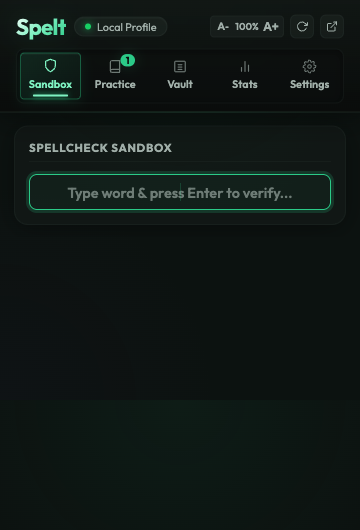
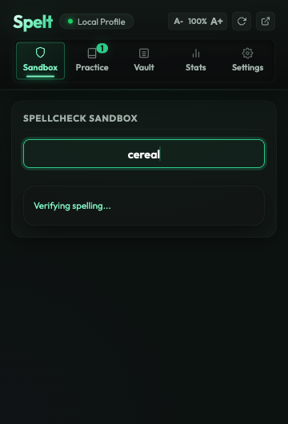
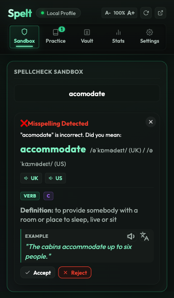
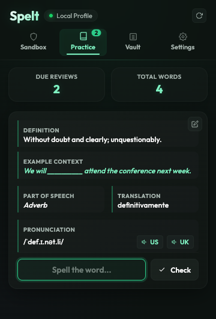
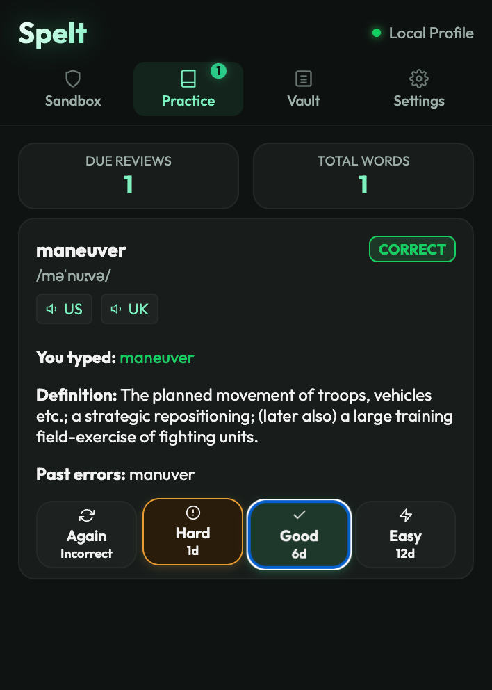
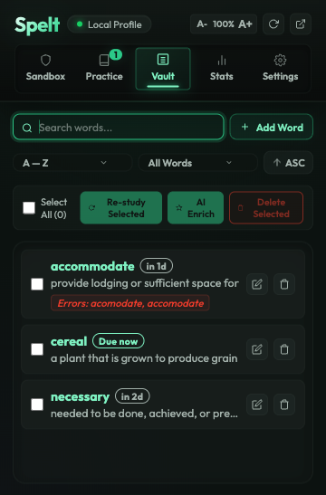

<p align="center">
  
</p>

<h1 align="center">Spelt</h1>

<p align="center">
  A Chrome extension that helps you actually <em>learn</em> the words you keep misspelling.<br>
  Built around spaced repetition, not just red underlines.
</p>

<p align="center">
  
  
  
</p>

---

## What is this?

Most spell checkers tell you something is wrong and move on. Spelt does the opposite — it remembers what you got wrong and makes sure you practice it until you actually know the spelling. No more googling "accommodate" for the fifth time this week.

The idea is simple: type a word, check the spelling, and if it's wrong, Spelt saves the correction and queues it for spaced repetition review. Over time, your problem words surface less and less as you nail them. Once you spell a word correctly on the first try, it is marked as Mastered and automatically skipped from reviews.

<p align="center">
  
</p>

## Features

### 🔍 Spellcheck Sandbox
Type any word and press **Enter** to check it against a dictionary API. 
* **If spelled correctly**: Spelt saves the word with its definition, phonetics, and pronunciation, awards you XP, and marks it as Mastered.
* **If misspelled**: Spelt shows suggested corrections. You can accept a suggestion, manual-correct it, or reject it. The misspelled word is queued for SRS practice.
* Keyboard shortcuts let you verify, accept suggestions, play audio, and dismiss cards without touching your mouse.

<p align="center">
  
  &nbsp;&nbsp;&nbsp;&nbsp;
  
</p>

### 🗂️ SRS Practice Deck
Words you got wrong show up as flashcards. You see the definition, phonetics, and sample sentences (if available). 
* Type the spelling and press **Enter** to check.
* Rate your review using the SM-2 buttons or numeric shortcuts (`1`-`4`).
* Mastered words are automatically excluded from the deck to keep your reviews focused.

<p align="center">
  
  &nbsp;&nbsp;&nbsp;&nbsp;
  
</p>

### 🔑 Word Vault & Bulk Operations
A searchable, filterable vault to manage your vocabulary.
* **Smart Filtering**: Filter by card status (Due, New, Active/Learning).
* **Sorting**: Sort by alphabetical order, date added, or next review date (ascending or descending).
* **Relative Countdown Badges**: See exactly how much time is left until a word is due for review (e.g., "Due now", "in 2h", "in 3d", "in 1mo").
* **Bulk Editing**: Select multiple words (or check the Select All box) to perform bulk deletes in a single action.

<p align="center">
  
</p>

### 🔊 Pronunciation & Speech Synthesis Fallback
Hear how words are pronounced using local dialect audio (US/UK) fetched directly from the dictionary API. If the API doesn't provide audio files for a word, Spelt automatically falls back to the browser's native `SpeechSynthesis` API with high-quality English voices, making sure pronunciation buttons are always visible and interactive.

### 🔥 XP & Streaks
Earn XP for correct spellings in the Sandbox or by clearing daily practice decks. Track your daily consistency with a visual combo streak indicator.

### 📊 Full Dashboard
Open the full-page dashboard (`dashboard.html`) for a wider workspace, including analytics calendars, retention heatmaps, and progress tracking.

### 💾 Export / Import
Back up your database as a clean JSON file and restore it on any device. Works seamlessly across both the popup and dashboard views.

---

## Keyboard Shortcuts

Spelt is designed to be fully navigable from the keyboard so you can study without moving your hands to the mouse.

### Global Chrome Command
* **Ctrl+Shift+S** (Mac: **Control+Shift+S**) opens the Spelt popup instantly from any webpage.
* *To customize this shortcut, paste `chrome://extensions/shortcuts` into your Chrome address bar.*

### Spellcheck Sandbox
| Hotkey | Context / State | Action |
|---|---|---|
| **Enter** | Focused in input field (with text) | Verify word spelling |
| **Enter** | Misspelling card visible | Accept top suggestion |
| **Enter** | Correct feedback card visible | Clear input and refocus for the next word |
| **Space** | Any feedback card visible (input not focused) | Play pronunciation audio |
| **Escape** | Misspelling card visible | Reject suggestion and open manual correction |
| **Escape** | Correct feedback card visible | Close the card |

### Practice Deck
| Hotkey | Context / State | Action |
|---|---|---|
| **Enter** | Front of card (input focused) | Check spelling and flip card |
| **1** | Back of card (flipped) | Rate as **Again** (reset interval) |
| **2** | Back of card (flipped) | Rate as **Hard** (comes back in 1 day) |
| **3** | Back of card (flipped) | Rate as **Good** (standard progression) |
| **4** | Back of card (flipped) | Rate as **Easy** (longer interval jump) |

---

## How to Install

1. Clone or download this repository.
2. Open `chrome://extensions` in Google Chrome.
3. Enable **Developer Mode** using the toggle in the top-right corner.
4. Click **Load unpacked** and select the folder containing this project.
5. Pin the extension to your Chrome toolbar for easy access.

---

## Project Structure

```
Spelt/
├── manifest.json          # Chrome extension config (Manifest V3)
├── shared/
│   └── storage.js         # Database layer + SM-2 algorithm
├── popup/
│   ├── popup.html         # Extension popup UI
│   ├── popup.css          # Popup styles
│   ├── popup.js           # Entry point
│   └── js/
│       ├── sandbox.js     # Spellcheck sandbox controller
│       ├── practice.js    # SRS flashcard practice
│       ├── vault.js       # Word list management
│       ├── navigation.js  # Tab switching
│       └── settings.js    # Export, import, wipe, SRS tuning
├── dashboard/
│   ├── dashboard.html     # Full-page dashboard
│   ├── dashboard.css
│   ├── dashboard.js
│   └── js/
│       ├── sandbox.js
│       ├── practice.js
│       ├── vault.js
│       ├── analytics.js   # Streak, retention, heatmap stats
│       ├── navigation.js
│       └── settings.js
├── icons/
│   ├── icon-16.png
│   ├── icon-48.png
│   └── icon-128.png
└── docs/
    ├── banner.png
    └── screenshot-popup.png
```

---

## How the SRS Works

Spelt uses the **SM-2 (SuperMemo 2)** algorithm for scheduling reviews. Each word has an ease factor, repetition count, and interval that get updated every time you rate a card.

* **Again** — Reset the card. It stays due immediately so you practice it again right away.
* **Hard** — Short interval (1 day). The ease factor drops slightly.
* **Good** — Standard progression. Interval grows based on the ease factor.
* **Easy** — Aggressive interval jump. The card won't come back for a while.

There's also a spacing multiplier in Settings. Set it to 0.5x for faster repetition or 1.5x if you want a more relaxed schedule.

---

## APIs Used

* [Free Dictionary API](https://dictionaryapi.dev/) — Word definitions, phonetics, and audio
* [Datamuse API](https://www.datamuse.com/api/) — Spelling suggestions and fuzzy matching

Both are free with no API key required. All data stays in `chrome.storage.local`.

---

## License

MIT — do whatever you want with it.
